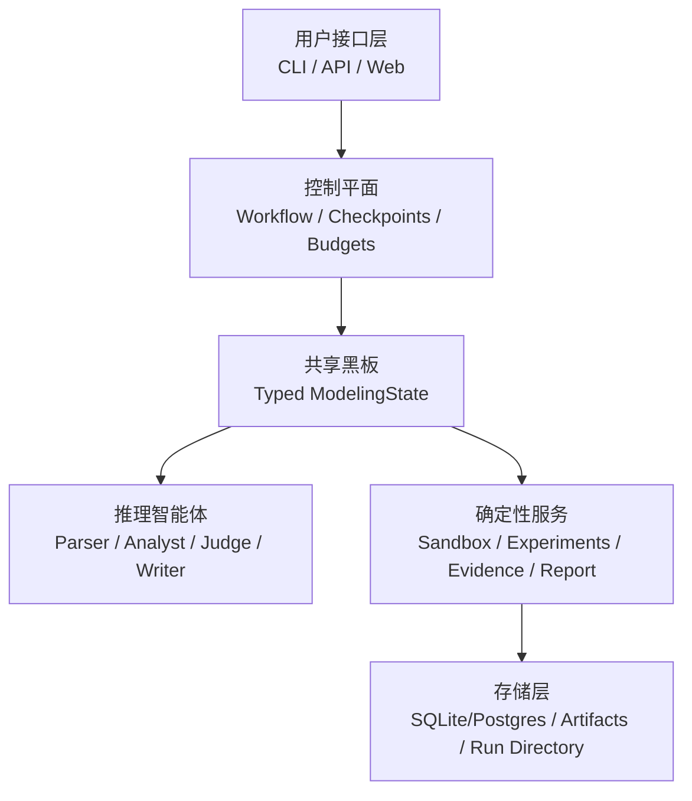

# ModelForge-SwarmAgent 中文说明

[返回英文主页 / Back to README](README.md)

> 面向数学建模的可审计多智能体协作系统

## 一句话介绍

ModelForge-SwarmAgent 试图解决的不是“让 Agent 聊天”，而是“让建模流程可复现、可审计、可回放”。

它把一道数学建模题拆成结构化工作流：

- 先解析问题
- 再提出多种策略
- 用真实代码做试验
- 把结论绑定到证据
- 最后生成报告和复现包

## 先看入口

- 英文主页：[README.md](README.md)
- 双语长介绍：[INTRODUCTION.md](INTRODUCTION.md)
- 实现状态：[IMPLEMENTATION_STATUS.md](IMPLEMENTATION_STATUS.md)
- 架构总览：[docs/architecture/overview.md](docs/architecture/overview.md)
- 工作流细节：[docs/architecture/workflow.md](docs/architecture/workflow.md)

## 项目解决什么问题

很多 Agent 系统可以快速写出“像样的答案”，但难以回答下面几个关键问题：

- 指标到底是不是跑出来的？
- 代码有没有真的执行？
- 结论是不是来自已验证证据？
- 多轮自动修复是否有边界？
- 最终结果能不能复盘？

ModelForge-SwarmAgent 的目标，就是把这些问题都变成“可以检查”的工程事实。

## 核心思路图


## 它和普通 Agent Demo 的区别

### 1. Agent 只负责推理，不负责伪造结果

语言模型适合做这些事：

- 理解题意
- 比较路线
- 提出建模方案
- 批判方案缺陷
- 组织报告结构

但真正必须可验证的部分，例如实验指标、日志、产物文件、证据状态，全部交给确定性服务和沙箱执行。

### 2. 报告必须受证据约束

报告不是“写得像”就行。系统要求：

- 指标先来自真实运行
- claim 先完成验证
- writer 只能使用 verified claims

这会明显降低“编结果”的风险。

### 3. 自动化有边界

系统不是无限制自动循环。它对下面这些都有控制：

- 重试次数
- 调试循环
- checkpoint 暂停点
- 预算与运行时间
- 审计事件记录

## 架构图



## 一个典型运行流程

假设你有这两个文件：

- `problem.txt`
- `data.csv`

系统可能会这样推进：

1. 解析题目，判断这是预测、优化还是图分析问题。
2. 分析数据结构，检查缺失、异常和泄漏风险。
3. 从方法库中检索适合的思路。
4. 生成多种建模策略。
5. 用 skeptic 角色对策略挑错。
6. 对候选策略做 pilot run。
7. 选择更合理的正式路线。
8. 生成代码并放入沙箱执行。
9. 跑 baseline 与 robustness。
10. 把实验结果注册成 evidence claims。
11. 基于证据写报告。
12. 导出包含代码、日志、指标、图表、引用和 manifest 的 ZIP 包。

## 你最终会拿到什么

不是只有一份文字说明，而是一整套可检查结果：

- 实验代码
- metrics
- logs
- figures
- evidence records
- citations
- markdown 报告
- LaTeX 输出
- 可选 PDF
- reproducibility bundle

## 适用场景

### 数学建模竞赛训练

适合用来做：

- 题目拆解
- 路线对比
- 初版代码试跑
- 结果复盘

### 教学与课程演示

适合展示：

- 为什么 baseline 很重要
- 为什么 robustness 不能省
- 为什么报告要受证据约束
- AI 辅助系统如何做到透明

### 多智能体系统工程研究

适合研究：

- typed shared state
- bounded autonomy
- sandbox execution
- verification-aware report generation

## 快速开始

### 零外部依赖模式

```bash
pip install -e ".[dev,science]"
python -m modelforge.cli.main doctor
python -m modelforge.cli.main demo
```

默认使用：

- SQLite
- subprocess sandbox
- mock LLM

### 启用真实模型

```ini
MODELFORGE_LLM=openai
OPENAI_API_KEY=sk-...

# 或
MODELFORGE_LLM=anthropic
ANTHROPIC_API_KEY=sk-ant-...

# 或
MODELFORGE_LLM=deepseek
DEEPSEEK_API_KEY=sk-...
DEEPSEEK_BASE_URL=https://api.deepseek.com/v1
```

### CLI 示例

```bash
modelforge init
modelforge create-run --profile practice
modelforge upload <run_id> problem.txt data.csv
modelforge start <run_id>
modelforge status <run_id>
modelforge export <run_id> --out bundle.zip
```

## 当前仓库状态

当前仓库已经具备：

- CLI
- FastAPI API
- Next.js Web 控制台
- 示例工作流
- 复现包导出
- 较完整的测试覆盖

详细状态见 [IMPLEMENTATION_STATUS.md](IMPLEMENTATION_STATUS.md)。

## 文档导航

- [README.md](README.md)
- [INTRODUCTION.md](INTRODUCTION.md)
- [docs/api/README.md](docs/api/README.md)
- [examples/README.md](examples/README.md)
- [docs/deployment/README.md](docs/deployment/README.md)

## 许可证

Apache-2.0，详见 [LICENSE](LICENSE)。
